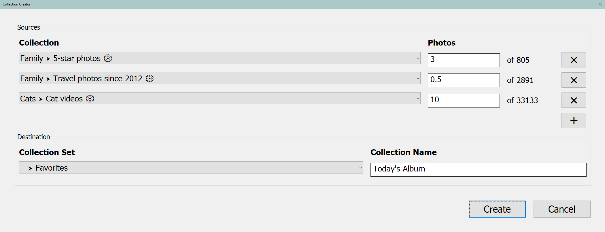

# Collection Creator

A Lightroom Classic plugin that creates new Collections by randomly sampling photos from the catalog.

A typical approach is to use Smart Collections to express filtering criteria and then sample from those to create a new Collection. For example, you might want to create a daily album of 10 random family photos by sampling from a Smart Collection (say, photos with the *family* keyword rated *3-stars* or better). That said, you can draw from any Collection and the mechanism is general enough to be adapted for a variety of purposes.

## Installation

1.  Download the latest zip file from the [Releases](https://github.com/marfire/CollectionCreator/releases/) page.
2.  Unzip the file and put the contained `CollectionCreator.lrplugin` folder somewhere in the file system.
3.  In Lightroom, go to `File > Plug-in Manager...` and click the `Add` button at the bottom left.
6.  Choose the `CollectionCreator.lrplugin` folder and click `Select Folder`.
8.  The plugin should now be installed and enabled. Click `Done`.

### Upgrading

To install a new version of the plugin, simply replace the original `CollectionCreator.lrplugin` folder with the new one. You will then need to restart Lightroom (or click the `Reload Plug-in` button in the Plug-in Manager).

## Usage

In Lightroom, go to `Library > Plug-in Extras` and select `Create Collection...` to bring up the Collection Creator dialog.

You can add as many source rows as you like. Each one specifies a Collection and a number of photos to sample. Smart Collections are indicated with a gear icon `⚙`. There are buttons to remove each row, as well as a button to add a new row.

If there is a fractional part to the number of photos, that will be interpreted as the probability that you get one additional photo. For example, a value of `10.4` means that there is a 40% chance that 11 photos will be chosen and a 60% chance that 10 will. A value of `0.5` means that there is a 50% chance that a single photo will be chosen.

The destination section consists of a location and a name for the new Collection. The location can be local or part of a configured Publish Service. By default the name will be the current date.

Click `Create` to create the new Collection. If a Collection by that name already exists you'll be asked whether you want to overwrite it.

Each time the dialog opens it  will default to the sources and destination chosen the last time it was successfully run.

## Issues
You can report a bug by [opening an issue](https://github.com/marfire/CollectionCreator/issues) on GitHub.

## License

[MIT](LICENSE.md)